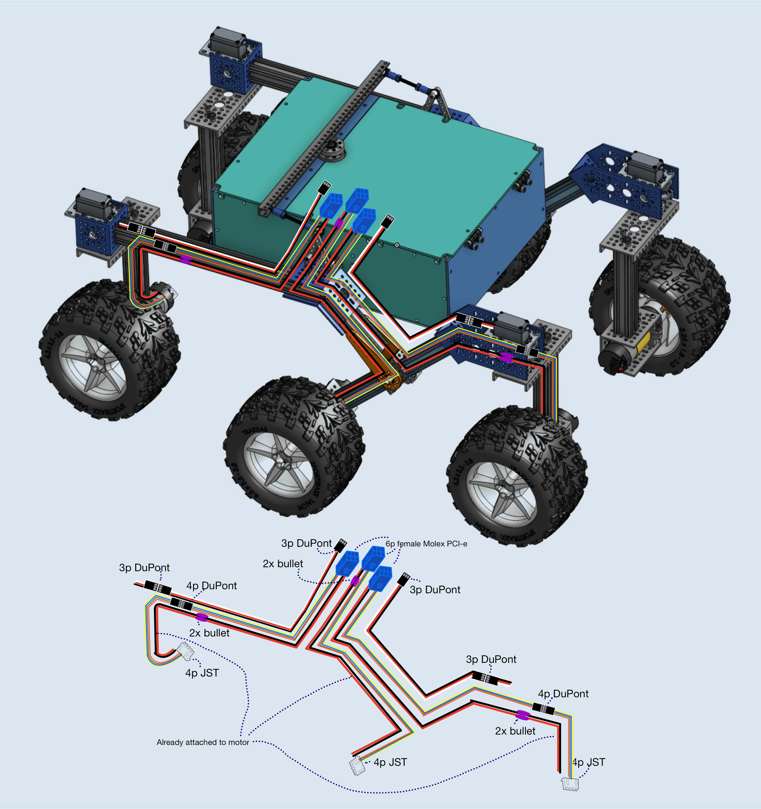
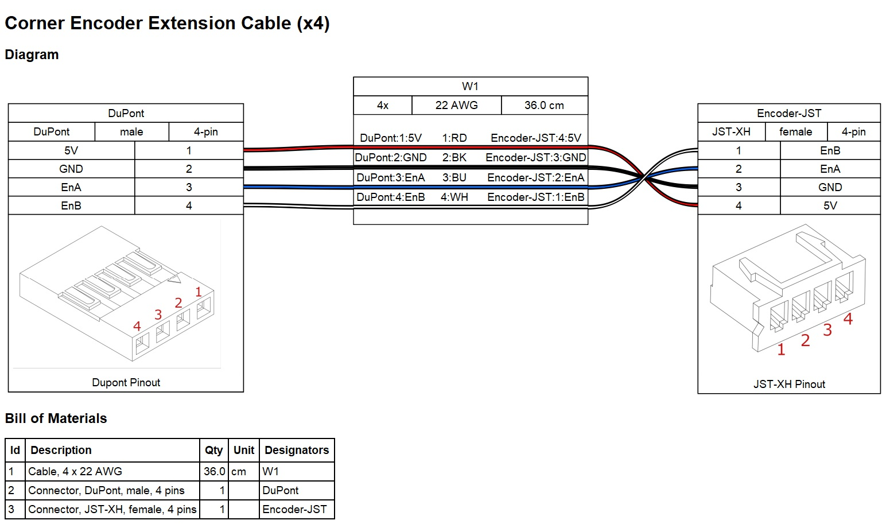
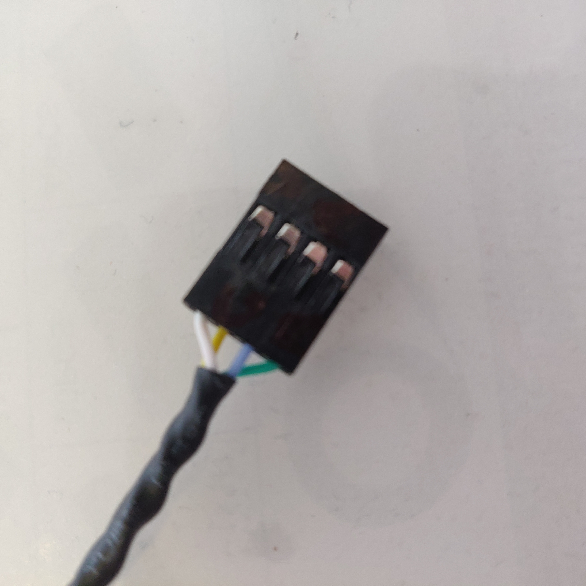
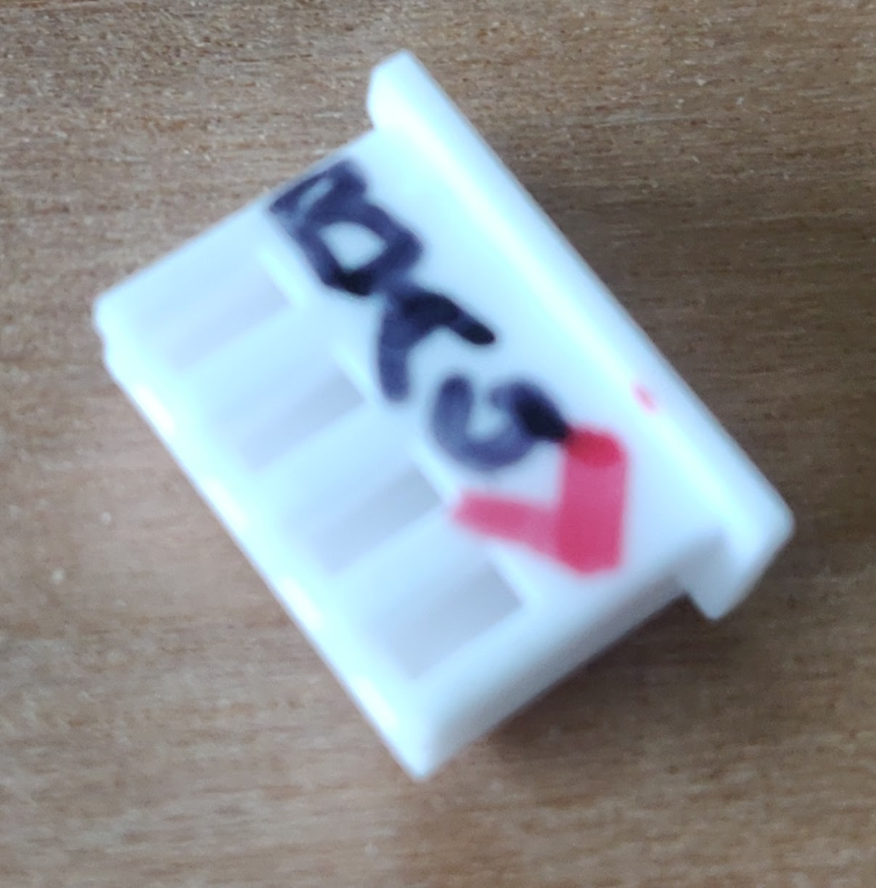
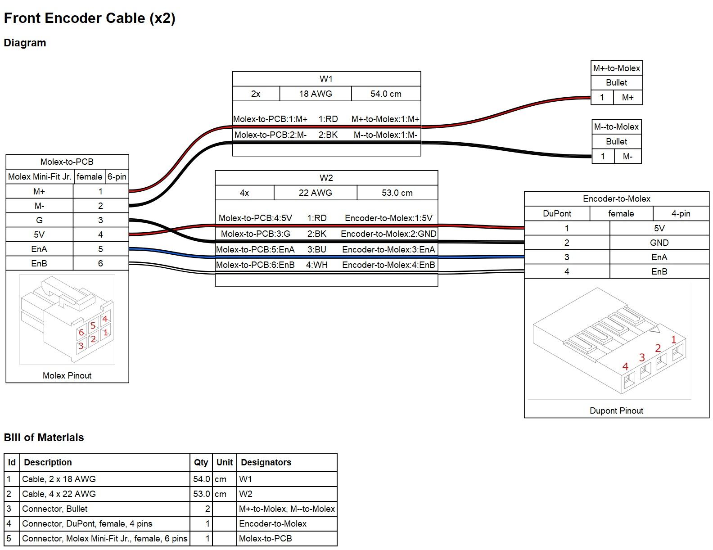
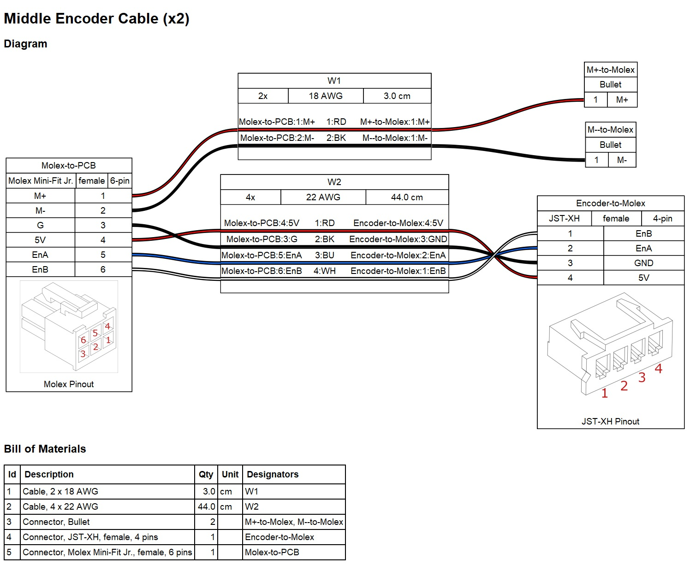
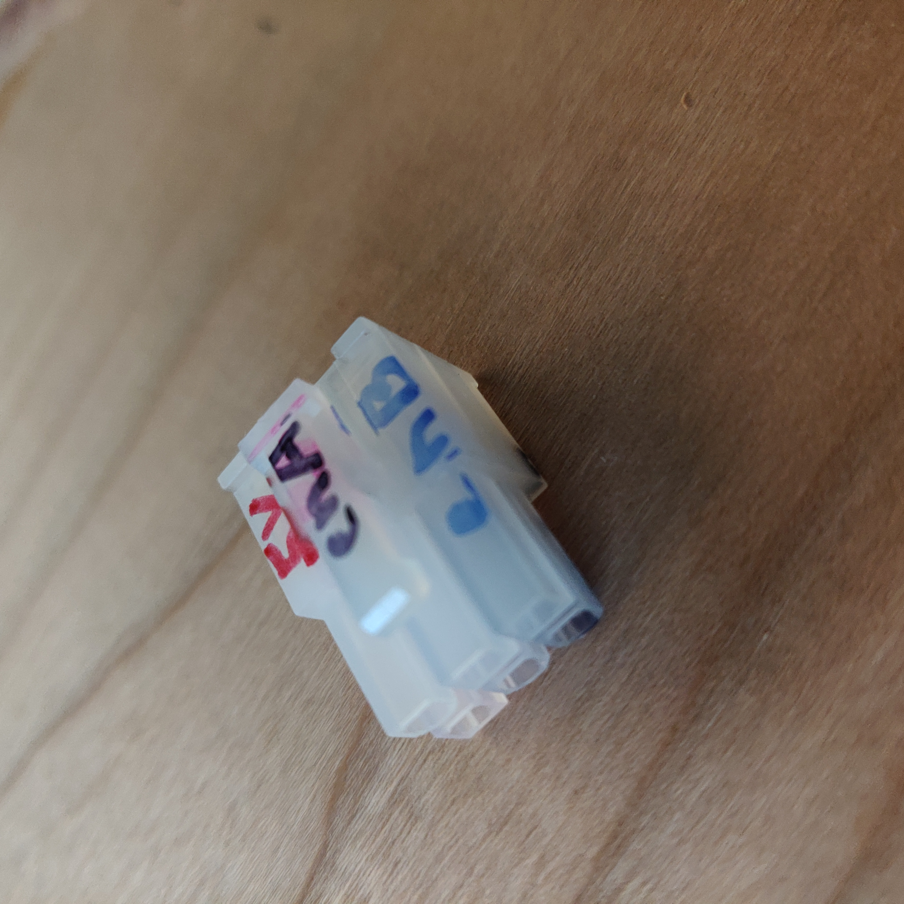
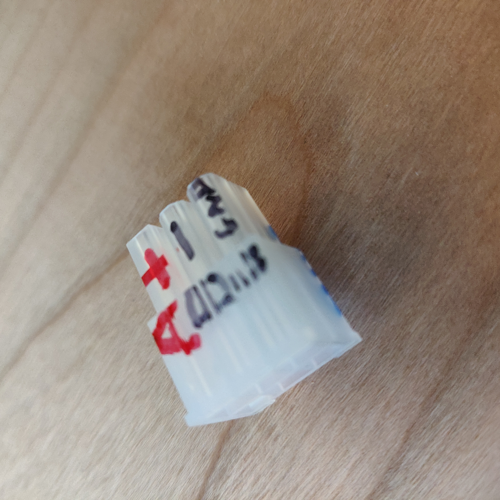
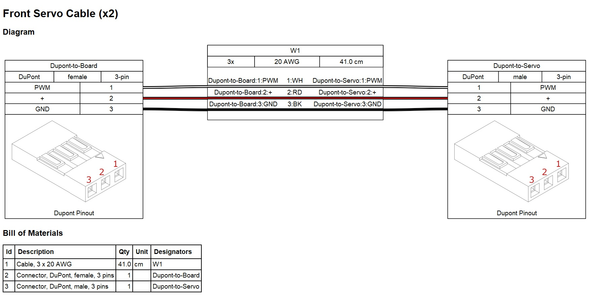

# Wiring

The wiring is what connects each of the 10 motors to the motor board carrying power and data. While creating the wiring requires a bit of patience, it's important that it's done properly so there's a consistent connection to the motors. Loose wires mean that the rover will not work as well or at all. Mechanical assemblies are more easily repaired than faulty wiring. If you have all parts ready to go, it could take between 2 and 5 hours to complete, depending on your skill level with crimping.

Wiring diagram for one side of the rover. The other side is identical.

Harness diagrams further below were generated with [WireViz](https://github.com/wireviz/WireViz/) and can be re-generated with the *generateHarness.bat/.sh* scripts.

>**Some notes on terminology:**

>***Wiring harness*** *(also called **cable harness** or **wire assembly**)*: the collective term for all the wiring and cables that are run through a system to connect power sources, sensors, data lines, etc. In the case of the rover, this means the cables that feed power to the motors, the control signals to the servos, and the encoder data back to the control boards. 

>***Cable***: A group of wires/conductors, usually with an outer sheath.

>***Wire***: A single conductor, solid or stranded core, of any gauge.

## Overview

We will be building several cables, all visualized in the above diagram. Make sure you have all wire types and connectors and understand the routing of the cabling as it will save you time down the line.

1. **4x**: JST female 4pin &harr; Dupont female 4pin (**connects to (2)**)
   * We'll use these to connect the drive motor encoders at the corners to the top of each corner
   * Having an intermediate connection allows us to swap out motors, perform testing, and route the wires through the parts much easier.
   * These are all of length **35cm** (all lengths excluding connector length)
   * You can also buy 4 premade cables [from Gobilda](https://www.gobilda.com/encoder-breakout-cable-4-pos-jst-xh-mh-fc-to-4-x-1-pos-tjc8-mh-fc-300mm-length/). They are a bit shorter so you can make the wires in Step (2) 5cm longer without any issue.
2. **4x**: Dupont male 4pin &harr; 4-pins of female Molex connectors
   * These will connect the drive motor encoders for each corner to the PCB through the rocker-bogie. The DuPont male side will plug into (1)
   * The Molex connectors will be inserted in the 6-pin PCI-E connector
   * 2 of these should be **52cm** long for the front, the other 2 should be **45cm** long for the back
3. **2x**: JST female 4pin &harr; 4-pins of female Molex connectors
   * These will connect the drive motor encoders for the two middle wheels to the PCB
   * The Molex connectors will be inserted in the 6-pin PCI-E connector that plugs into the PCB
   * These will both be **53cm** long
4. **6x**: 2-pin female bullet connector &harr; 2-pin female Molex connector
   * These will connect the two drive motor power supplies (M+ and M-) to the PCB
   * 2 of these are **2cm** long for the middle wheels
   * 2 of these are **53cm** long for the front wheels
   * 2 of these are **40cm** long for the back wheels
5. **4x**: Dupont male 3pin &harr; DuPont female 3pin connectors
   * These will connect the corner servo motors to the PCB
   * 2 of these are **53cm** long for the front corner servos
   * 2 of these are **35cm** long for the back corner servos

In total: 24 JST female crimps, 6 JST female connectors, 36 female DuPont crimps, 6 MH-FC PCI-E connectors, 28 male DuPont crimps, 16 female DuPont crimps, 4 3pin DuPont connectors, 8 4pin DuPont connectors, and 12x bullet connectors+crimps.

The harness diagrams in this README also contain an integrated bill-of-materials (BOM) for each cable so you can organize the parts appropriately.

> **Tip**: Rather than crimp each wire yourself, you can buy premade connectors, cut the wires, and then solder them to the other side. For soldering using a heat gun, you could get something like the following: [heat gun solder seal wire](https://www.amazon.com/Amliber-Connectors-Solderstick-Waterproof-Electrical/dp/B0BXKHBDFB/ref=sr_1_3?keywords=heat%2Bgun%2Bsolder%2Bseal%2Bwire&qid=1690233825&s=industrial&sprefix=heat%2Bgun%2Bsolder%2Cindustrial%2C159&sr=1-3&th=1). This depends on your preferences. When using premade connectors, be extra careful of the pinouts so you connect the correct wire ends together.

> **Tip**: For the thinner (AWG20 and AWG22) wiring we strongly recommend using ribbon cable (where each wire strand is attached to the next) to keep wires clean and strong. Alternatively you can twist the wires which also helps reduce interference from electrical noise.

## Cut the wires to length

We want to be consistent with the color coding of your wires so we can troubleshoot easier. For example M+ (motor positive) should always be red and M- black for all drive motors. We'll also use the same colored wires for all encoders. We'll add one centimeter to each piece of wire for inserting into the connectors.

As can be seen on the diagram, we'll have three color coded types:

* *servo wire*: white, red, and black for the servo motors. The servo motors already have wires in these colors. wire gauge: 20AWG.
  * Cut 2 pieces of 53+1=54cm
  * 2 pieces of 36cm
* *encoder wire*: 4 colors of your choice for the drive motor encoders (in diagram: yellow, blue, brown, orange). wire gauge: 22AWG.
  *  Cut 4 pieces of length 35+1=36cm
  *  2 pieces of 53cm
  *  2 pieces of 46cm
  *  2 pieces of 54cm
* *power wire* black and red for the drive motor power. wire gauge: 18AWG.
  * Cut 2 pieces (of red and black wire) of 2+1=3cm
  * 2 pieces of 54cm
  * 2 pieces of 41cm

Optional but recommended: put two pieces of heat shrink on each set of wires. This allows you to securely remove a connection without accidentally stressing one wire/crimp too much. It also prevents the wires from detaching from one another.

Heat shrink around a female 4p JST connector.

## Step (1) 4x: JST female 4pin &harr; Dupont female 4pin

Use the 4 pieces of 36cm *encoder wire*. Separate the wire ends from the ribbon cable so you can attach crimps to each wire. Using a wire stripper, remove about 3mm of wire protector from each wire. On one side of each 4-wire cable, use a crimping tool to attach a female JST crimp to each wire.

> **Tip**: There are many great resources online to learn how to crimp effectively. Put the crimp into the crimping tool and lightly clamp down so the crimp doesn't fall out. Then inside the wire end and complete the crimp. When you have completed the crimp, give it a solid tug to test if it's properly attached. Loose crimps will backfire later!

On the other side of the cable, you will attach 4 Dupont female crimps. You now have one of 4 crimped wires, so repeat the process for the 3 other wires.

Now we'll insert each crimped cable into the appropriate connectors. Start by writing the pinout on each of the connectors for easy troubleshooting using a sharpie: B, A, G, 5 for channel B, channel A, ground, and +5V respectively. Copy over the annotations from the images below to your connectors, paying close attention to the orientation of each connector. Use the harness diagram below as a guide to make sure that each connector is in the right position in its housing. 

> **Tip**: On single row connectors like the JST-XH and the DuPont, there is usually a mark on the connector housing (like a triangle or a cutout) that indicates position 1. These are more visible in the harness diagrams.

|  |  |
| ---------------------------------------------- | ------------------------------------------------- |
| Dupont 4p connector. From top to bottom: VCC/5V (white) &rarr; GND (yellow) &rarr; enA (blue) &rarr; enB (green) | female 4p JST connector. From top to bottom: enB &rarr; enA &rarr; GND &rarr; VCC/5V |
Finally insert the crimps into the connectors. Repeat for all cables, using the same coloring for each connector hole. If you used heat shrink, use a heat gun to secure the connection.

> **Tip**: When you finish a cable, use the connection testing setting on your multimeter so verify that your cables work. This will save you a lot of time debugging in the future!

## Step (2) 4x: Dupont male 4pin &harr; 4-pins of female Molex connectors

These cables will connect the Dupont side of the cables we made in step (1) to the PCB via a 6pin PCI-E connector with female Molex connectors.

This process is very similar to the steps we did in (1), except we'll use male DuPont crimps on one side and female Molex crimps on the other side. For the male DuPont connector side, make sure the wires match the female DuPont connector you made in Step (1).

Grab the 2 pieces of **encoder wire** of 53cm and 2 pieces of 46cm and prepare the wire ends for crimping. Attach the crimps to each wire and repeat for each set of wires.
As before, mark the connectors as in the images below, then insert the wires into the connectors. 

|  |  |
| ------------------------------------------------- | ------------------------------------------------------- |
| Top of PCI-E connector. 5V &rarr; enA &rarr; enB | bottom of PCI-E connector. M+/A &rarr; Mi/B &rarr; GND |

Mark the PCI-E connector with on each of the two longer cables with 'F' for front and the two connectors attached to the shorter cables with 'B' for back. This will prevent inserting the cables into the wrong slot on the PCB since all cables arrive into the body through the same goRail. The remaining two slots for M+ (A) and M- (B) on each of these connectors will be filled in step (4).

## Step (3) 2x: JST female 4pin &harr; 4-pins of female Molex connectors

These 2 wires that connect the drive motor encoders for the middle wheels to the PCB directly are a combination of cables (1) and (2), skipping the intermediate DuPont connector. Mark the PCI-E connector for each of the two cables with 'M' for middle.

## Step (4) 6x: 2-pin female bullet connector &harr; 2x female Molex connector

Grab the 6 pairs of red and black *power wire*. On each wire side attach a female bullet connector on one side and a female Molex connector on the other. 

* For the two shortest cables you made, insert the Molex end into the open slots on the middle PCI-E connector you assembled in Step (3).
* For the two longest cables you made, insert the Molex end into the open slots on the front PCI-E connector you assembled in Step (2).
* For the two mid-length cables you made, insert the Molex end into the open slots on the back PCI-E connector you assembled in Step (2).

You now how all the wiring completed for the drive motors!

## Step (5) 4x: Dupont male 3pin &harr; DuPont female 3pin connectors

All that's left are the servo ribbon cables. The red and black wires are (+) and (-) voltage to the motor and the white cable carries the PWM signal to command the on-board controller to command the motor to the desired angle, using the built-in absolute encoder. The PCB header pins for the servo motors are wired in the same order (PWM, (+), (-)) so we're essentially building an extension cord in this step. One one side you'll be using male DuPont crimps while on the other you'll use female DuPont crimps. The connectors for both sides are identical.

You should now have 12 finished cable assemblies. Congratulations! Don't forget to make sure each connection is solid and tested before moving on.
