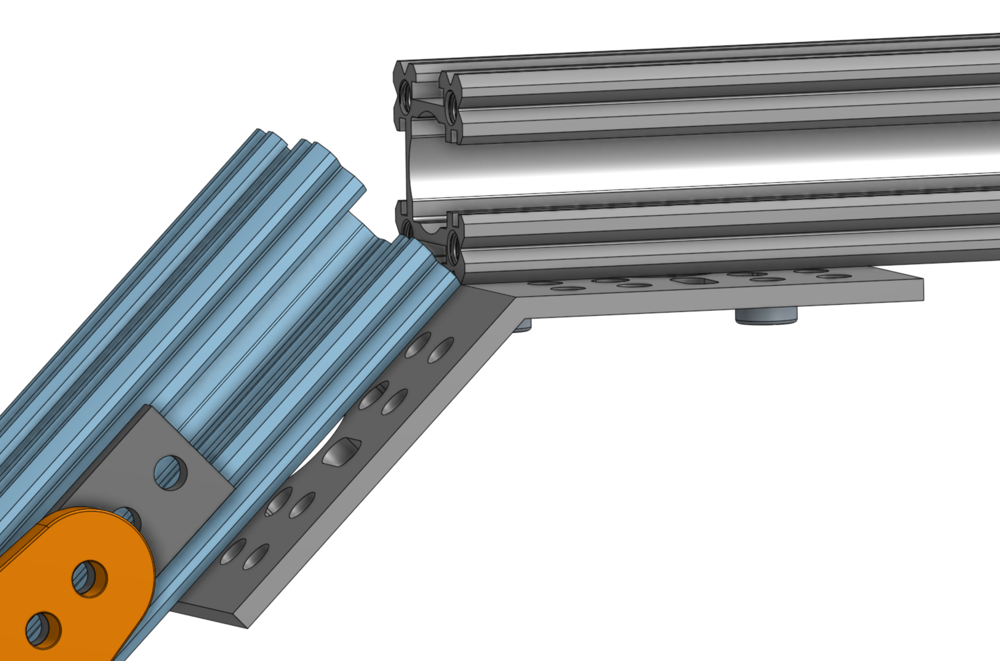

# Rocker-Bogie Suspension

**IN PROGRESS**

The Rocker-Bogie is the suspension system that enables the rover to climb aggressive obstacles. The design allows all 6 wheels to be in contact with the ground as much as possible, increasing traction.  The suspension system on a typical consumer vehicle can traverse obstacles about half the height of one wheel; the Rocker-Bogie suspension system can traverse obstacles over 2 times the height of the wheel.

## Features

* Modular link lengths give the ability to customize rover geometry
* Optimized for climbing in the forwards direction
* Rigid support structure resists lateral bending/twisting about the Bogie joint

## Mechanical Interface/Attachments to Rover

* Servo block output shafts connect to corner motor assemblies
* rocker-bogie connects to the body axis clamp via two brackets that are detailed in the [integration readme](../../integration/README.md)
* middle drive motor connects to the extruded shaft at the bottom

## Assembly

You will be creating two almost identical assemblies. Below instructions are for one side. We recommend building one side first rather than trying to build both sides in parallel, that way you'll be able to make the other side faster. Before you start building, familiarize yourself with the details of this assembly, in particular because you'll be building two assemblies that are mirrorred. Specifically, you'll want the open slits on the bogie to be facing the same side:

### Creating the rocker-bogie joint

Assemble the joint following the steps below. Since the clamp in the middle isn't symmetric and protrudes on one side, two spacers of different lengths are used. You can see this in the top left image. You'll use spacer `1522-0010-0040` of length 4mm on the side of the clamp that has the protrusion, while on the other, flat side, you'll use spacer `1514-0010-0060` of length 6mm. This creates a tight assembly that prevents the joint from flexing from side to side.

|             |         |
| -------------------------------------- | ----------------------------------- |
|  |  |

Wait with the yellow and orange (ball bearing) parts. The bearing should first be inserted into the yellow hub.

> **Tip**: Use the OnShape model and navigate to the tab 'rocker-bogie' in the bottom to isolate this assembly. Then right click on various parts to temporarily hide them so you can see how the assembly works in 3D.

### Attach the joint bearings to the servo arms

Connect the hub (yellow) with the inserted bearing to the servo arm using button M4 screws. When done, the bearing should not be able to fall out. Put these 2 assemblies aside for now.

### Attach the extruded shafts

Pay attention to direction of the slits for the cabling

### Attach the front servo

First attach the bracket to the shaft you just attached to the joint using three or four M4 screws. Then assemble the servo block to the servo. Insert the set screw that came with the servo inside the hollow shaft that fits onto the spline profile on the servo output, but don't tighten it yet as we'll have to readjust later when calibrating the corner motors. This screw prevents the corner assembly from falling off the rocker-bogie while driving.

Route the wiring from the servo motor through the hole and into the extruded shaft, then attach the servo motor and block to the front rocker-bogie bracket.

TODO: insert image

### Connect the servo arms and shaft to the joint

Make sure the slit in the extruded shaft faces either up or down (preference) so that you can easily route wiring through later.

Slide one of the servo arms with bearing and hub you made in an earlier step over one side of the rocker-bogie joint such that the hub faces the inside and the black servo arm faces the outside. Now take a steel bracket, two hurricane nuts, and attach the black servo arm to the extruded shaft using two M4 screws and the nuts. Tighten such that you can still slide the servo arm relative to the channel. Flip the assembly over and repeat on the other side, making sure the setup is symmetric.

### Assemble the back servo

Attach the 1-channel U bracket to the long extruded shaft using 3 or 4 M4 screws. Assemble another servo block as you did before. Insert this into the 1-channel bracket.

### Attach the front and back of the rocker-bogie

Use 4 hurricane nuts and the 45 degree bracket to connect the back and the front of the rocker-bogie using M4 socket screws of length 8mm as in the image below.

Flip the assembly over and attach the two brackets like in the picture below, using 4 more hurricane nuts and socket screws to secure the pieces to the rocker bogie aluminum extrusions. Then route all wires through the aluminum channel that will eventually slide into the rover body. The slit in the channel should orient in the direction where most of the cables enter it (flipped compared to the image below) but either direction works. 

|  |
| --- |
| Wiring snugly fits inside the extruded aluminum channels. Only use this image as an idea of how the wiring should be routed, other parts of this image may not reflect the current state of the rocker-bogie at this stage in the process. |

Secure the channel to the rocker-bogie using 5 hurricane nuts (2 at the bottom) and socket screws, making sure the channel end sits flush to the other channels and the wiring isn't squeezed inbetween.

Repeat these steps for the other rocker-bogie, making sure it mirrors the first assembly. Once you're done, you're ready with these very important subassemblies!
