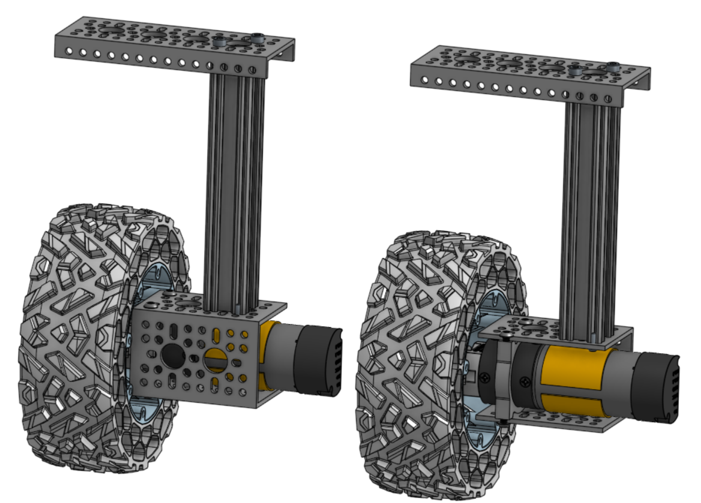

# Wheel Assembly

The wheel assembly attaches the wheels to the motors and mounts the motors to the rest of the rocker-bogie suspension system that makes up the robot chassis. These are relatively simple to assemble.

## Features

* The flexible wheels allow for high traction as they deform around objects, improving climbing performance
* Drive motors chosen to handle the high torque that the system sees, achieving both speed and climbing performance

### Mechanical Interface/Attachments to Rover

* The 4 corner assemblies connect directly to the servo blocks on the rocker-bogies.
* The 2 middle drive wheels attach directly to the rocker bogie

## Machining/Fabrication

**NOTE:** While the following approach is valid for v2, it is not ideal as it requires drilling. There may be better ways to attach to these wheels (or other wheels) without drilling. The only requirement is that the middle of the corner wheels aligns with the axis of rotation of the servo output shaft.

**NOTE**: These instructions are a work in progress. Please ask for assistance on Slack.

| item                              | ref | qty |                                                                 img |
| --------------------------------- | --- | --- | ------------------------------------------------------------------: |
| wheels                            | S30 | 6   |  |
| hand drill or drill press         | D3  |     |        |
| center punch or starter drill bit | D7  |     |        |

> The wheel is normally meant to be mounted using one bolt through the middle of the rim. This will not work well in our case as the rover sees very high torque at the wheel and the one-bolt system would be difficult to attach to any part of our system without the wheel slipping. To attach more firmly, we will drill two holes on either side of the original hole where we will mount the motor hub clamp as shown in Figure 1

Drill at least 2 holes in the wheels such that they can be mounted to the [Sonic Hub](https://www.gobilda.com/1309-series-sonic-hub-8mm-rex-bore/) that attaches to the motor shaft. 

## Assembly

You will need all the parts in the [drive wheel assembly parts list](../../parts_list/README.md#Parts-for-drive-wheel-assembly).

### Assembling the base wheel mounts

Next, we will build the wheel assemblies which are divided into the middle wheels and corner wheel assemblies. We will build 6 identical base wheels and then add slightly more complexity onto 4 of those which will eventually become the corner wheels.

Attach the clamping mount and REX bore hub to the motor. We will adjust their positioning later.

## Four corner assemblies

4 of the 6 drive assemblies you just built will become the corner motors. That only requires two mechanical pieces along with some screws but we'll want to route the wiring through the extruded channel.

The result excluding wiring should look as follows:

|  |  |
| ------------------------------------------ | --------------------------------------------- |

Note that the sides of the rover are mirrored and so you'll be building 2 pairs of similar but not exactly the same subassemblies, as shown in the right image above.

Start by laying out the pieces for each corner so you end up with the 2 mirrored pairs. Take the DuPont to 4-pin JST encoder pins you created in [wiring](../electrical/wiring/README.md) and route them through the top low-profile U-channel, the extruded aluminum, and finally through the motor bracket. The DuPont connector should be at the top with the 4-pin JST connector at the bottom, ready to be connected to the motor encoder pins. Route the two motor power cables through the same parts in the opposite direction. Finally, screw the parts together using 3 or 4 button screws inside the U-channel and using 3 or 4 socket screws at the top. Don't tighten the screws too much yet as this will allow you to adjust wiring.

Adjust the wiring so there is minimal wiring inside the channel. Make sure to protect your wiring from chafing or cutting from the sharp aluminum edges! Be careful when adjusting wires so to not damage the plastic shielding and potentially create shorts.

Repeat this for the 3 other corner assemblies.
